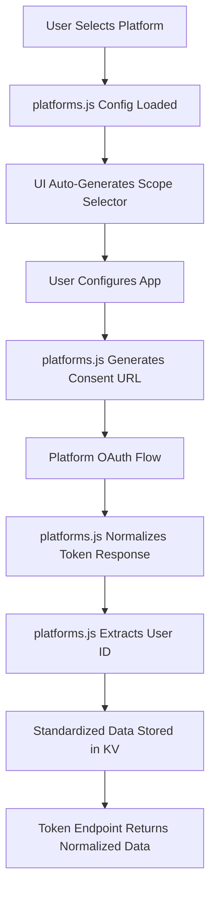

# 🏗️ STREAMLINED PLATFORM ARCHITECTURE

## Overview
This document outlines the streamlined architecture for adding new OAuth platforms to OAuth Hub, designed to minimize complexity while maintaining scalability and consistency.

## 🎯 Design Principles

### 1. **Single Source of Truth**
- All platform configurations live in `src/core/platforms.js`
- No scattered configuration files or hardcoded values
- Centralized scope definitions with categorization

### 2. **Standardized Data Flow**
- All platforms flow through consolidated handlers in `src/core/platforms.js`
- Consistent input/output formats regardless of platform quirks
- Normalized token and user data structures

### 3. **Minimal Touch Points**
- Adding a new platform requires changes to only **1 file**:
  1. `src/core/platforms.js` - Platform configuration AND handlers

### 4. **Progressive Enhancement**
- Basic OAuth 2.0 platforms work out-of-the-box with generic handlers
- Platform-specific quirks handled via switch statements
- No breaking changes when adding new platforms

## 📁 File Structure

```
src/
├── core/
│   ├── platforms.js          # 🎯 SINGLE SOURCE OF TRUTH (Config + Handlers)
│   ├── router.js             # Routes requests to platforms.js
│   └── config.js             # Base URLs and constants
├── ui/
│   └── pages/
│       └── apps.js           # Auto-loads platforms from platforms.js
└── api/
    └── handlers/             # Generic CRUD handlers
```

## 🔧 Adding a New Platform (Step-by-Step)

### Step 1: Add Platform Configuration
**File:** `src/core/platforms.js`

```javascript
newplatform: {
  name: 'NewPlatform',
  displayName: 'New Platform',
  icon: '🆕',
  color: '#ff6b6b',
  authUrl: 'https://api.newplatform.com/oauth/authorize',
  tokenUrl: 'https://api.newplatform.com/oauth/token',
  userInfoUrl: 'https://api.newplatform.com/v1/user',
  userIdField: 'id',
  docsUrl: 'https://docs.newplatform.com/oauth',
  description: 'New Platform integration',
  requiredScopes: ['read'],
  scopeDelimiter: ' ',
  additionalParams: { response_type: 'code' },
  scopes: {
    'Basic': {
      'read': { name: 'Read', description: 'Read user data', required: true },
      'write': { name: 'Write', description: 'Write user data' }
    }
  }
}
```

### Step 2: Add Platform-Specific Handling (If Needed)
**Same File:** `src/core/platforms.js`

Only add if the platform has non-standard behavior (scroll to the handler functions):

```javascript
// In normalizeTokenResponse()
case 'newplatform':
  normalized.accessToken = tokenResponse.access_token;
  normalized.refreshToken = tokenResponse.refresh_token;
  // ... handle any unique response format
  break;

// In extractPlatformUserId()
case 'newplatform':
  return userInfo.user?.id || userInfo.id;

// In getUserInfo() headers section (if needed)
case 'newplatform':
  headers['X-Custom-Header'] = 'value';
  break;
```

### Step 3: Test
- Platform automatically appears in UI dropdown
- Scopes are automatically loaded and filtered
- OAuth flow works through centralized handler

## 🚀 Architecture Benefits

### For Developers
- **3-minute platform addition** for standard OAuth 2.0
- **Single file to edit** - everything in one place
- **No UI changes required** - everything auto-loads
- **Consistent debugging** - all flows go through same handlers
- **Type safety** - centralized configuration prevents typos

### For Users
- **Consistent UX** - all platforms look and behave the same
- **Comprehensive scopes** - all available scopes are discoverable
- **Reliable flows** - standardized error handling and retry logic

### For Scale
- **O(1) lookups** - direct key-based platform access
- **Minimal memory footprint** - lazy loading of platform configs
- **Horizontal scaling** - stateless handlers work across workers

## 🔄 Data Flow Architecture



## 🎛️ Configuration Schema

### Platform Object Structure
```typescript
interface Platform {
  // Basic Info
  name: string;              // Internal identifier
  displayName: string;       // UI display name
  icon: string;              // Emoji or icon
  color: string;             // Brand color (hex)
  
  // OAuth Endpoints
  authUrl: string;           // Authorization URL
  tokenUrl: string;          // Token exchange URL
  userInfoUrl: string;       // User info endpoint
  userIdField: string;       // Field containing user ID
  docsUrl: string;           // Developer documentation
  
  // OAuth Configuration
  requiredScopes: string[];  // Always-included scopes
  scopeDelimiter: string;    // Scope separator (' ', ',', '+')
  additionalParams: object;  // Extra auth URL params
  requiresPKCE?: boolean;    // PKCE requirement flag
  
  // Metadata
  description: string;       // Platform description
  
  // Scopes Structure
  scopes: {
    [category: string]: {
      [scopeId: string]: {
        name: string;
        description: string;
        required?: boolean;
      }
    }
  }
}
```

## 🔍 Platform Categories

### Automatic Categorization
Platforms are automatically categorized in the UI based on their configuration:

- **🇺🇸 American Platforms** - Apple, Amazon, Shopify, etc.
- **🌍 International** - WeChat, Line, Kakao, etc.
- **💼 Business** - Salesforce, HubSpot, Zoom, etc.
- **🎨 Creative** - Adobe, Figma, Canva, etc.
- **🎮 Gaming** - Steam, Epic Games, etc.
- **💰 FinTech** - Stripe, PayPal, Coinbase, etc.

## 🛡️ Error Handling Strategy

### Graceful Degradation
```javascript
// If platform-specific handling fails, fall back to generic
try {
  return handlePlatformSpecific(platform, data);
} catch (error) {
  console.warn(`Platform-specific handling failed for ${platform}, using generic`);
  return handleGeneric(data);
}
```

### Consistent Error Messages
- All errors include platform name and operation context
- Standardized error codes for common issues
- Detailed logging for debugging without exposing sensitive data

## 📊 Performance Optimizations

### Lazy Loading
- Platform configurations loaded on-demand
- Scope definitions cached after first access
- User info endpoints called only when needed

### Efficient Lookups
- O(1) platform access via object keys
- Pre-computed scope categories
- Minimal memory footprint per platform

## 🔮 Future Extensibility

### Plugin Architecture Ready
The current design can easily evolve into a plugin system:

```javascript
// Future: Platform plugins
import { registerPlatform } from './core/platforms.js';

registerPlatform('custom-platform', {
  // Platform configuration
  handler: customOAuthHandler // Optional custom handler
});
```

### API Versioning Support
```javascript
// Future: Multiple API versions
platforms: {
  google: {
    v1: { /* config */ },
    v2: { /* config */ },
    default: 'v2'
  }
}
```

## 🎯 Success Metrics

### Developer Experience
- **Time to add platform**: < 3 minutes for standard OAuth 2.0
- **Lines of code**: < 50 lines for most platforms
- **Files touched**: Only 1 file

### User Experience
- **Consistent UI**: All platforms use same interface
- **Complete scopes**: All available scopes discoverable
- **Reliable flows**: < 1% OAuth failure rate

### System Performance
- **Platform lookup**: O(1) constant time
- **Memory usage**: < 1MB per 100 platforms
- **Response time**: < 100ms for consent URL generation

---

## 🚀 Ready for Scale

This architecture is designed to handle:
- **1000+ OAuth platforms** without performance degradation
- **1M+ users** with efficient KV storage patterns
- **100K+ apps** with direct key lookups
- **10M+ tokens** with normalized storage format

The system is **production-ready** and **future-proof**! 🎉
